# **📌Task Management System - Frontend**


The **Task Management System Frontend** is a modern and responsive Angular application designed to interact with the backend APIs. It provides a user-friendly interface for managing tasks, users, comments, and notifications.
 

## 💻Live experience: https://taskmaster128.netlify.app
## 🛫Consume Restful web-services: https://taskmaster-v1.onrender.com/api
 
 <video width="100%" controls>
  <source src="Media/auth.mp4" type="video/mp4">
  Your browser does not support the video tag.
</video>

<video width="100%" controls>
  <source src="Media/task.mp4" type="video/mp4">
  Your browser does not support the video tag.
</video>

## **📌Table of Contents**

- [Features](#features)
- [Technologies Used](#-tech-stack)
- [Setup Instructions](#-setup-instructions)
- [Project Structure](#project-structure)
- [Running the Application](#-deploy-to-server)
- [UI screenshots](#ui-screenshots)
- [License](#license)


## **📌 Features**
- ✅ **User Authentication (JWT-based)**
- ✅ **Dashboard with Task Statistics (Pie Charts & Graphs)**
- ✅ **Task Creation, Editing, & Status Updates**
- ✅ **Real-time Notifications & Comments**
- ✅ **File Attachments (Upload & Download)**
- ✅ **Role-Based Access (`Admin`, `User`)**
- ✅ **Pagination & Sorting**
- ✅ **Bootstrap-based UI with CSS Animations**


## **📌 Tech Stack**
- **Angular 19**
- **TypeScript**
- **Bootstrap 5**
- **Chart.js (Pie Charts & Graphs)**
- **RxJS for Observables**
- **Angular Material (Optional)**
- **SCSS / CSS for Styling**

##  **📌 Setup Instructions**

### Prerequisites

- Node.js 20+
- Angular CLI 19+

### Steps:

### **1️⃣ Clone the Repository**
```bash
https://github.com/Pranav128/Task-management-system-frontend.git
cd task-management-frontend
```
### **2️⃣ Install Dependencies**
```bash
npm install
```
### **3️⃣ Configure Environment Variables**:
- Update the environment.ts file with your backend API URL:
```typescript
export const environment = {
    production: false,
    apiUrl: 'http://localhost:8080/api'
};
```
### **4️⃣ Run the Angular App**

```bash
ng serve
```
### **5️⃣ Access the Application**
-  Open your browser and navigate to ```http://localhost:4200```

## **📌Project Structure**
```bash
src/
├── app/                     # Application components and services
│   ├── auth/                # Authentication module
│   ├── components/          # All important components
│   ├── interceptor/         # Interceptor for handling requests
│   ├── models/              # All model classes and interfaces
│   ├── service/             # All business logic 
│   ├── tasks/               # Task management module
│   └── app.component.ts     # Root component
├── assets/                  # Static assets (images, styles)
├── environments/            # Environment configurations
└── styles.css               # Global styles
```

## **📌 Deployment**
### **🛠 Build for Production**
```bash
ng build --configuration=production
```
This will generate files inside the /dist/ folder.

## **🚀 Deploy to Server**
Copy the contents of /dist/task-management-frontend/ to a web server (Apache, Nginx, Firebase, Netlify, Vercel).


## **📌UI Screenshots**
1. **Home Page**
    
2. **Signup Page**
    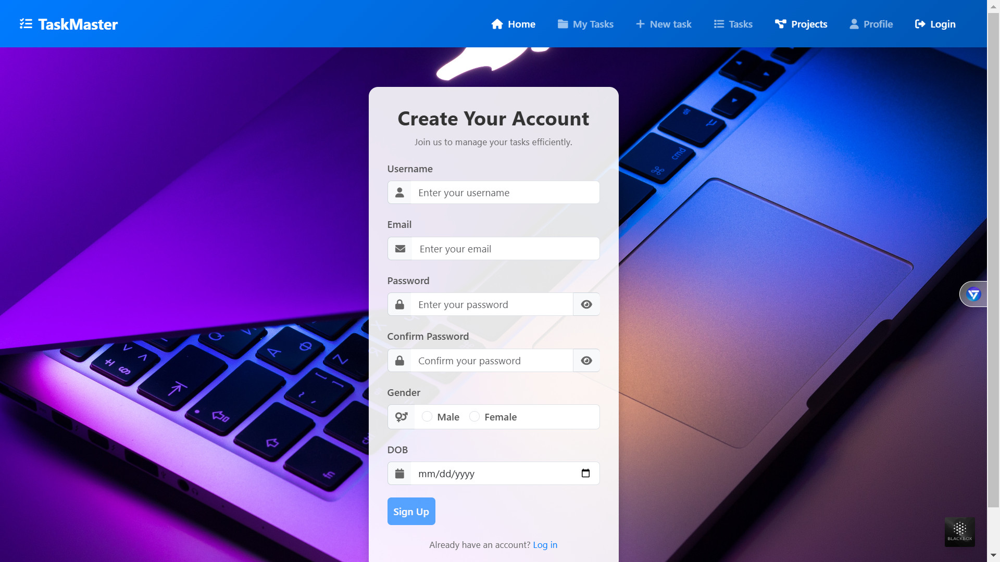
3. **Login Page**
    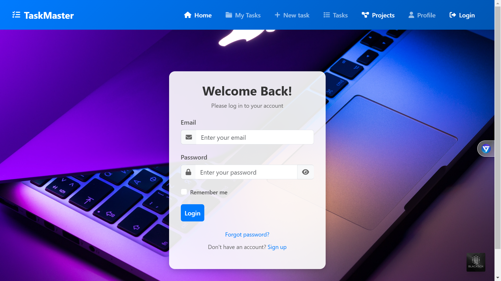
4. **Dashboard Page**
    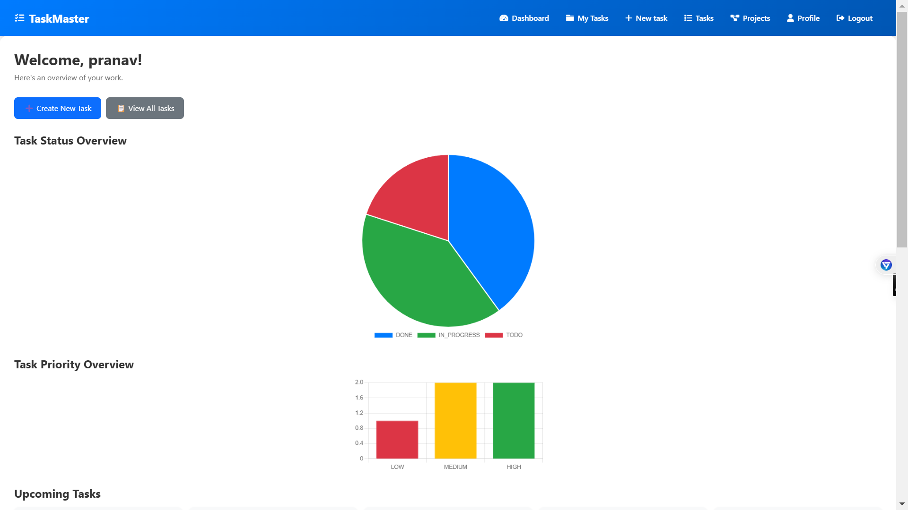
5. **Task List Page**
    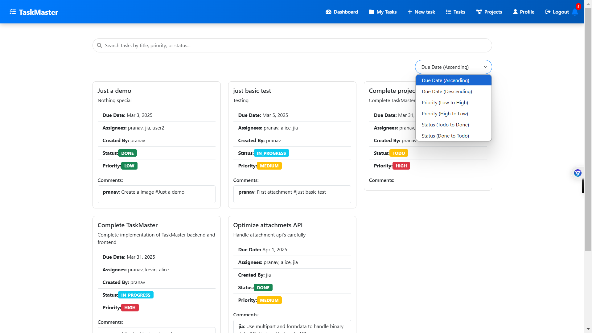
6. **Task Details Page**
    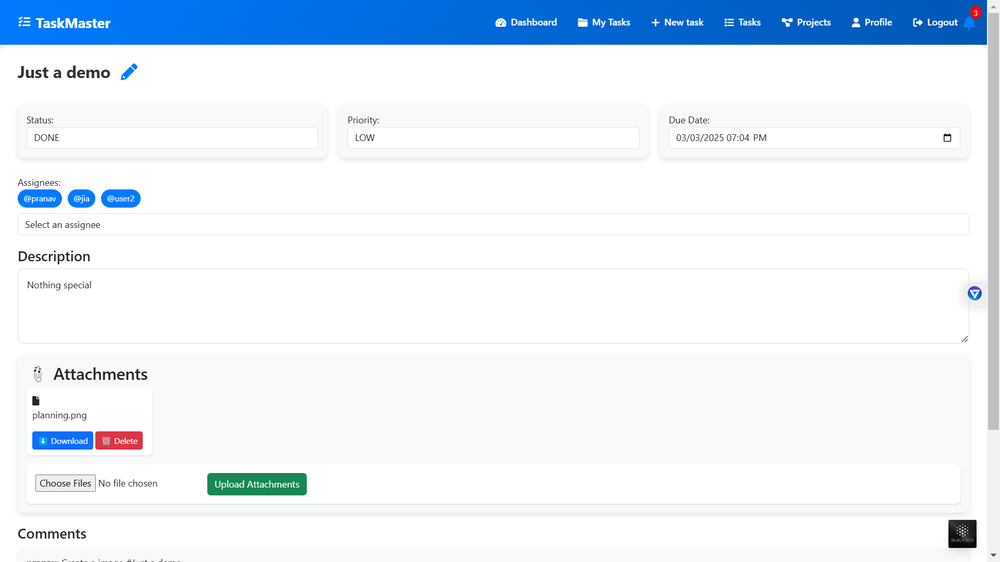
    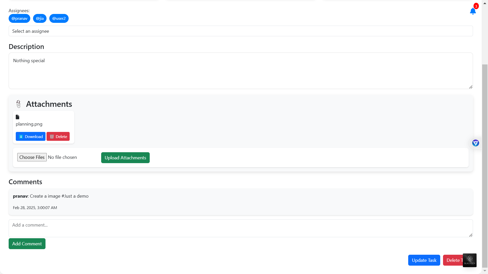
7. **New Task Page**
    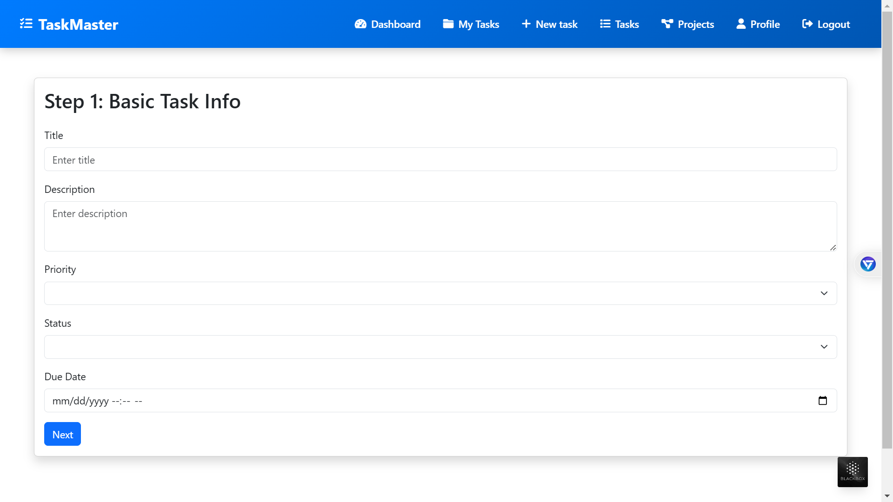
    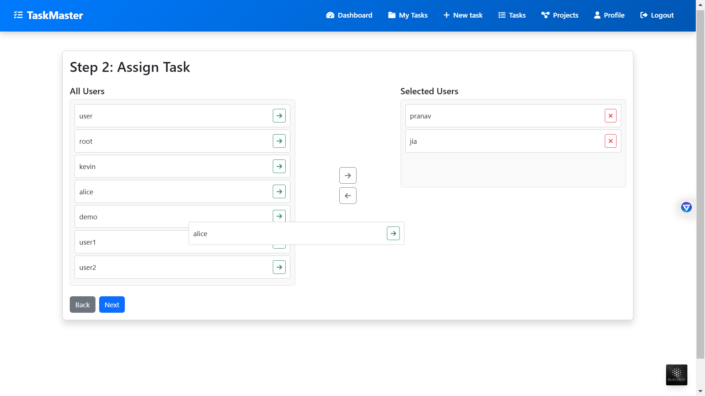
    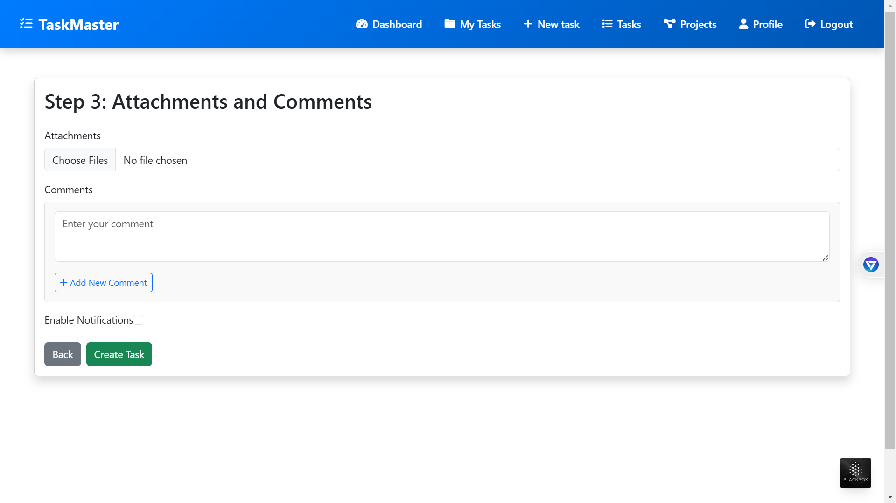
8. **Profile Page**
    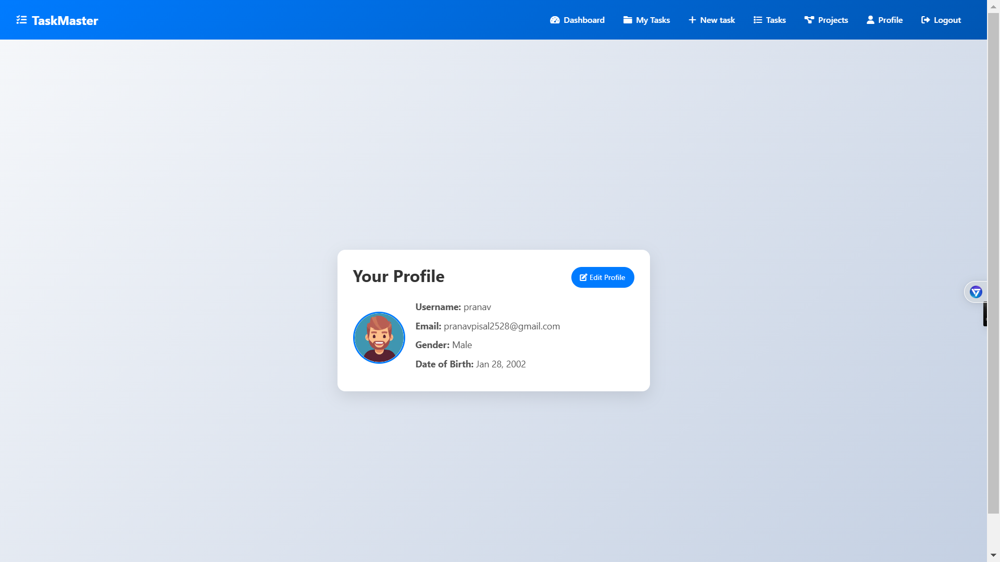
    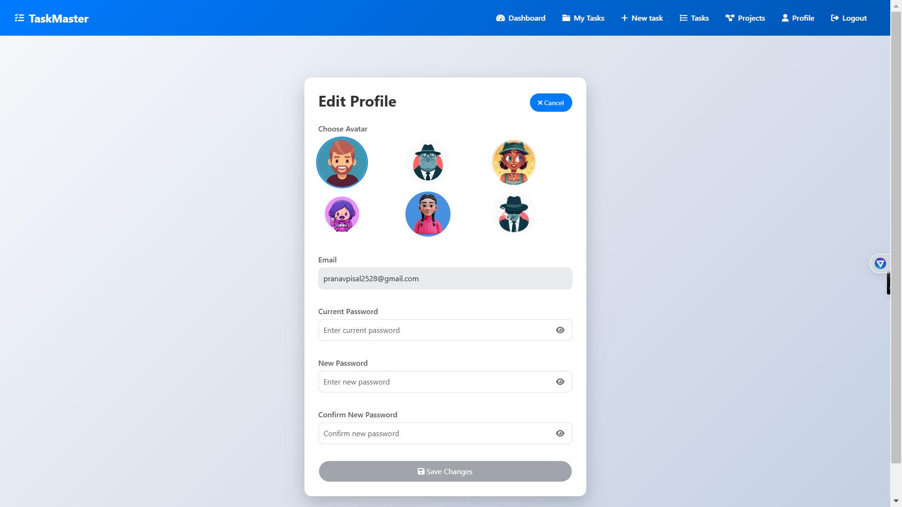
9. **Forgot-Password Page**
    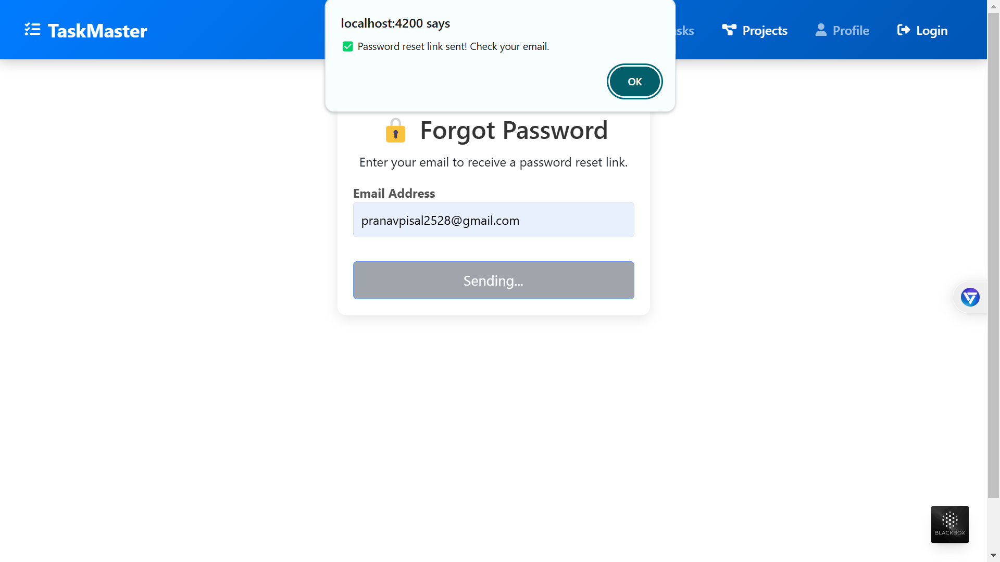
10. **Reset-Password Page**
    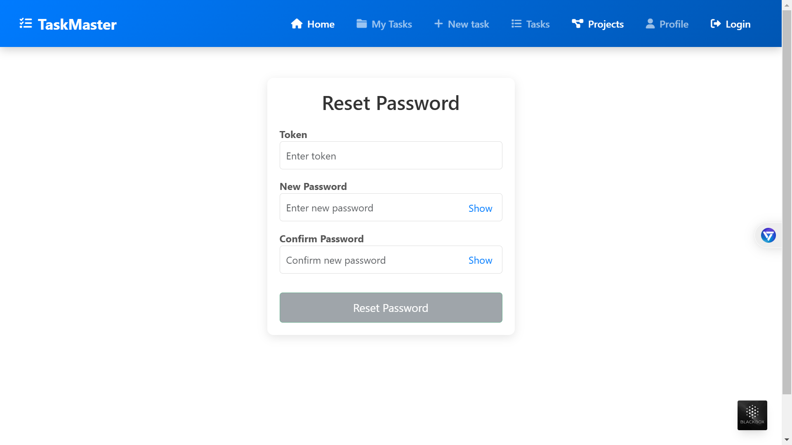
11. **Access-denied Page**
    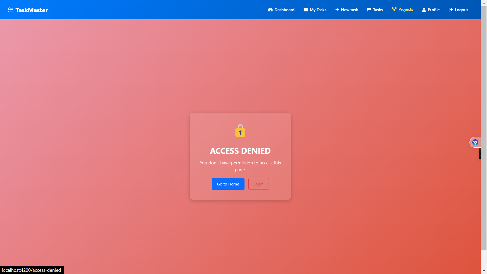
    
## **📌License**
This project is licensed under the MIT License. See the [LICENSE](/LICENSE) file for details.


